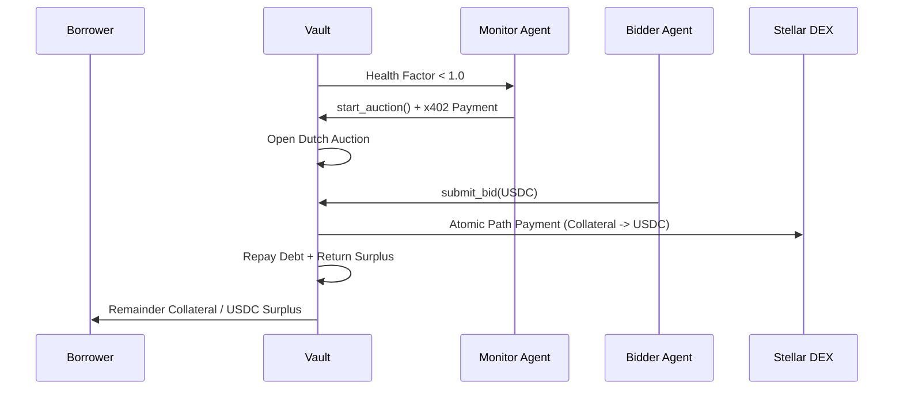

# LendX Protocol Architecture

This document details the technical primitives that enable autonomous lending on
Stellar.

## 1. x402 Machine Payments

LendX uses **x402** not as a payment bolt-on, but as the mechanism by which
agents become economic actors _inside_ the protocol.

- **Atomic Compensation**: When a Monitor Agent calls `start_auction()`, it
  receives the trigger fee atomically in the same operation.
- **Protocol Integration**: Payment is part of the protocol interaction logic,
  ensuring agents are always compensated for maintaining system health without
  needing external accounting.
- **Self-Sustaining Agents**: Agents use these fees to re-fund their Stellar
  accounts for gas (XLMs) and operational costs, creating an indefinite loop of
  autonomous maintenance.

## 2. Action Model Programming

LendX agents do not "decide" via LLM reasoning in the critical path. Instead,
they use **Action Model Programming**:

- **Discrete Actions**: The agent possesses a formal vocabulary of discrete
  actions (e.g., `monitor`, `trigger_auction`, `bid`).
- **Preconditions and Effects**: Every action has defined preconditions (e.g.,
  "position is liquidatable") and deterministic effects.
- **State Recovery**: If an agent process crashes, it reads the current on-chain
  state upon restart and resumes exactly where it left off.
- **Auditability**: Every transition is inspectable on-chain, and the agent's
  logic is formally mapped to protocol rules.

## 3. Stellar-Native Primitives

LendX leverages Stellar's unique architecture for maximum efficiency:

### Soroban Smart Contracts

All logic for vaults, auctions, and agent interactions is handled by Soroban
contracts, providing a high-performance WASM execution environment.

### Atomic Path Payments

Liquidation is handled via atomic path payments on the Stellar native DEX. This
allows the protocol to:

1. Liquidate XLM collateral.
2. Convert it to USDC.
3. Repay the borrower's debt.
4. Return the surplus to the borrower. …all in a single transaction.

## 4. Liquidation Flow

